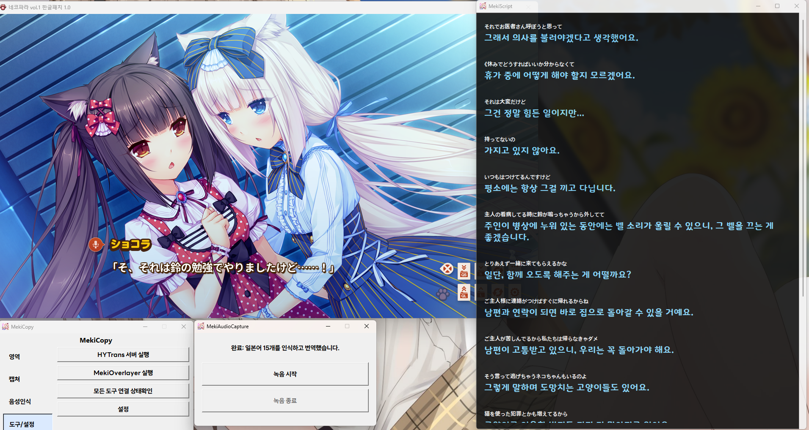

# MekiCopy

MekiCopy는 화면의 특정 영역을 지정한 뒤 OCR로 글자를 인식하고, 결과를 클립보드에 복사하는 도구입니다.  
선택적으로 HYTrans + MekiOverlayer와 연동하면 인식한 텍스트를 자동으로 번역해 화면에 바로 표시할 수 있습니다.
MekiAudioCapture + MekiScript를 사용하면 컴퓨터에서 재생되는 일본어 음성을 녹음한 뒤 일괄 인식·번역할 수 있습니다.

---

## 목차
1. [요구사양](#요구사양)
2. [설치](#설치)
3. [기본 사용 방법](#기본-사용-방법)
4. [영역 관리](#영역-관리)
5. [북마크](#북마크)
6. [분리된 버튼 창](#분리된-버튼-창)
7. [번역 오버레이 모드 (HYTrans + MekiOverlayer)](#번역-오버레이-모드)
8. [설정](#설정)
9. [음성인식 (MekiAudioCapture + MekiScript)](#음성인식)
10. [커맨드라인 사용법](#커맨드라인-사용법)
11. [주의사항](#주의사항)

---

## 요구사양
| 구분 | 최소 사양 | 권장 사양 |
|--------|--------|--------|
| 운영체제 | 윈도우 10 2004 이상 | 윈도우 10 2004 이상 |
| CPU | 4코어 이상 | 8코어 이상 |
| RAM | 16GB 이상 | 16GB 이상 |
| GPU | 요구사항 없음 | VRAM 6GB 이상의 GPU |

## 설치

### 소스에서 실행하는 경우

1. Python 3.12~3.14를 설치합니다.
2. `install_mekiocr.bat`을 실행해 필요한 패키지를 설치합니다.
   ```
   meikiocr==0.3.4, mss==10.2.0, pillow==12.3.0, numpy==2.5.2
   ```
3. `run_mekicopy.bat`을 실행하거나, 직접 `python mekicopy.py`를 실행합니다.

### 배포판(exe)을 사용하는 경우

[Releases](https://github.com/tchinso/MekiCopy/releases)에서 최신 버전을 다운 받아`MekiCopy.exe`를 직접 실행합니다. 별도 설치 없이 동작합니다.

---

## 기본 사용 방법

MekiCopy의 핵심 흐름은 다음과 같습니다.

```
임시 영역 선택 → 임시 영역을 확정 → 인식 후 복사
```

### 1단계: 임시 영역 선택

1. `임시 영역 선택` 버튼을 누릅니다.
2. 화면 전체가 반투명하게 어두워지며 영역 선택 화면이 열립니다.
3. 마우스로 드래그해 텍스트가 있는 영역을 선택합니다.
4. 선택 후 노란색 테두리와 핸들이 표시됩니다.
   - 테두리 가장자리(핸들)를 드래그해 크기를 미세 조정할 수 있습니다.
   - 선택 영역 내부를 드래그하면 위치를 이동할 수 있습니다.
5. `Enter` 키를 눌러 선택을 완료합니다. (`Esc`로 취소)

> 선택 완료 후 메인 화면의 **임시 영역** 좌표가 업데이트됩니다.

### 2단계: 확정 영역으로 덮어쓰기

1. `임시 영역을 확정` 버튼을 누릅니다.
2. 임시 영역이 **확정 영역**으로 등록됩니다.

> 확정 영역이 설정되어야 `인식 후 복사`를 사용할 수 있습니다.

### 3단계: 인식 후 복사

1. `인식 후 복사` 버튼을 누릅니다.
2. 확정 영역의 텍스트가 OCR로 인식됩니다.
3. 인식 결과가 클립보드에 자동으로 복사됩니다.
4. 메모장, 번역 사이트 등에 `Ctrl + V`로 붙여넣습니다.

### 텍스트 위치가 고정된 경우 (비주얼 노벨 등)

처음 한 번만 영역을 설정하면, 이후에는 `인식 후 복사`만 반복해서 누르면 됩니다.

---

## 영역 관리

메인 화면 왼쪽의 `영역` 탭에서 현재 **임시 영역**과 **확정 영역**의 좌표를 확인할 수 있습니다.

| 버튼 | 설명 |
|---|---|
| `임시 영역 선택` | 화면에서 드래그로 새 영역을 선택합니다. 이전 임시 영역이 있으면 그 위치에서 시작합니다. |
| `현재 임시/확정 영역 보기` | 현재 임시 영역(파란색)과 확정 영역(빨간색)을 화면에 겹쳐서 표시합니다. `Esc`로 닫습니다. |
| `임시 영역을 확정` | 임시 영역을 실제 인식에 사용할 확정 영역으로 등록합니다. |

---

## 북마크

자주 사용하는 영역을 이름을 붙여 저장해 두고 빠르게 불러올 수 있습니다.  
북마크 데이터는 `bookmarks.txt` 파일에 저장됩니다.

### 북마크 저장

1. 먼저 확정 영역을 설정합니다.
2. `확정 영역을 북마크에 추가` 버튼을 누릅니다.
3. 북마크 이름을 입력하고 확인합니다.
4. 같은 이름의 북마크가 있으면 덮어쓸지 확인합니다.

> **주의:** 북마크는 **확정 영역** 기준으로 저장됩니다. 임시 영역만 선택한 상태에서는 저장할 수 없습니다.

### 북마크 불러오기

1. `북마크 영역 불러오기` 버튼을 누릅니다.
2. 목록에서 원하는 북마크를 선택합니다. (`Enter` 또는 더블클릭)
3. 선택한 북마크가 **임시 영역과 확정 영역 모두에 즉시 적용**됩니다.
4. 바로 `인식 후 복사`를 눌러 사용할 수 있습니다.

> 불러온 뒤 영역을 미세 조정하려면 `임시 영역 선택`으로 다시 조정한 뒤 `임시 영역을 확정`을 누르세요.

---

## 분리된 버튼 창

`행동` 탭의 `'인식 후 복사' 버튼 분리하기` 버튼을 누르면 `인식 후 복사` 버튼만 있는 작은 별도 프로세스 창이 열립니다.

- 메인 창을 최소화하거나 다른 곳에 두고, 이 작은 창만 화면 한쪽에 배치해 사용하기 편합니다.
- 번역 오버레이 모드가 켜져 있으면 버튼 이름이 `번역 후 표시`로 바뀝니다.
- MekiCopy 본체가 비정상 종료되어도 분리 버튼 프로세스는 계속 실행되며, 마지막 확정 영역과 저장된 설정으로 동작합니다.
- 분리하기 버튼을 여러 번 눌러도 프로세스는 하나만 유지되고 기존 창이 앞으로 나옵니다.
- 설정에서 이 창의 동작을 세부 조정할 수 있습니다. ([설정 참고](#설정))

---

## 번역 오버레이 모드

OCR로 인식한 텍스트를 자동으로 번역해 화면에 바로 표시하는 모드입니다.  
**HYTrans** 서버와 **MekiOverlayer** 창이 함께 필요합니다.

### 구성 요소

| 구성 요소 | 역할 |
|---|---|
| **MekiCopy** | OCR 인식 및 전체 흐름 제어 |
| **HYTrans** | 번역 서버 (일본어 → 한국어, 기본 포트 6996) |
| **MekiOverlayer** | 번역 결과를 화면에 표시하는 투명 오버레이 창 (기본 포트 6997) |

| 설정 표시 | 모델 저장소 | 형식 |
|---|---|---|
| **MT2 (기본)** | `tchinso/Hy-MT2-1.8B-onnx-q4f16` | q4f16 |
| MT1.5 | `onnx-community/HY-MT1.5-1.8B-ONNX` | q4 |

HYTrans는 프로그램에 포함된 고정 버전 `Transformers.js 4.2.0`(4.x 최신)과 `ONNX Runtime Web/WASM 1.27.0`을 Chrome 또는 Edge에서 로컬로 읽습니다. 네트워크는 선택한 번역 모델을 처음 내려받을 때만 필요하며, 이후에는 `HYTrans/models`의 검증된 모델을 재사용합니다.

> **필수 조건:** Google Chrome 또는 Microsoft Edge가 설치되어 있어야 합니다.

### 사용 방법

1. `설정` 창을 열고 **번역 오버레이 모드** 섹션에서 `오버레이어 번역 모드 사용`을 체크한 뒤 MT2 또는 MT1.5를 선택합니다.
2. `저장`을 누릅니다. `도구/설정` 탭의 `HYTrans 서버 실행`과 `MekiOverlayer 실행` 버튼이 활성화됩니다.
3. `HYTrans 서버 실행` 버튼을 누릅니다.
   - HYTrans가 실행되면서 브라우저 창이 자동으로 열립니다.
   - HYTrans가 선택한 모델을 `HYTrans/models/<제작자>/<모델명>`에 직접 다운로드한 뒤 Worker가 로컬 모델을 로드합니다. **처음 실행 시 모델 다운로드에 시간이 걸립니다.**
   - 완전한 로컬 모델이 이미 있으면 네트워크에 접속하거나 다시 다운로드하지 않습니다. Worker에는 `다운로드 중`과 `로컬 모델 로드 중`이 구분되어 표시됩니다.
4. `MekiOverlayer 실행` 버튼을 누릅니다.
5. 확정 영역을 설정한 뒤 `번역 후 표시` 버튼을 누릅니다.
6. OCR → 번역 → MekiOverlayer 표시가 자동으로 이루어집니다.

### 연결 상태 확인

`도구/설정` 탭의 `모든 도구 연결 상태확인` 버튼은 서비스 종류, HYTransWorker 연결, 번역 모델 준비 상태와 MekiOverlayer 표시 흐름을 실제 응답으로 확인합니다.

### 주의사항

- HYTrans 서버가 준비되기 전에 `번역 후 표시`를 누르면 오류가 발생합니다. 브라우저에서 모델 로딩이 완료될 때까지 기다리세요.
- MekiCopy를 종료하면 HYTrans와 MekiOverlayer 프로세스도 함께 종료됩니다.
- HYTrans와 MekiOverlayer 포트가 다른 프로그램과 충돌하면 설정에서 변경할 수 있습니다.
- 실행 중 번역 모델이나 HYTrans 포트를 변경해 저장하면 기존 HYTrans를 정상 종료하고 포트가 해제된 뒤 새 설정으로 자동 재시작합니다.
- 번역 시간 제한은 MT1.5 120초, MT2 240초를 기준으로 입력 길이에 따라 늘어나며 최대 600초입니다.

---

## 음성인식

`음성인식` 탭에서 다음 순서로 실행합니다.

1. `HYTrans 실행`을 누르고 번역 모델 로딩이 끝날 때까지 기다립니다.
2. `MekiScript 실행`을 누릅니다.
3. `MekiAudioCapture 실행`을 누릅니다.
4. MekiAudioCapture에서 `녹음 시작`을 누르고 일본어 음성을 재생합니다.
5. `녹음 종료`를 누릅니다.

녹음 중에는 WASAPI loopback 음성을 `MekiAudioCapture.exe` 옆 `work` 폴더에 임시 WAV 파일로 저장합니다. 프로그램 폴더에 쓸 수 없는 설치 환경에서만 LocalAppData 등 쓰기 가능한 보조 경로를 사용합니다. 종료 후에 VAD와 일본어 STT를 실행해 모든 일본어 원문을 MekiScript에 먼저 쌓고, 그 다음 원문 단위별로 HYTrans 번역을 순서대로 채웁니다. 처리가 끝나면 임시 WAV와 변환 파일은 삭제됩니다.

| 구성 요소 | 역할 | 기본 포트 |
|---|---|---|
| MekiAudioCapture | 시스템 음성 녹음, VAD, ReazonSpeech 일본어 STT | 6998 |
| HYTrans | 일본어 원문 단위별 한국어 번역 | 6996 |
| MekiScript | 원문·번역 누적 표시 및 스크롤 | 6999 |

`모든 도구 연결 상태 확인`으로 세 앱의 HTTP 응답과 HYTransWorker/번역 모델 준비 상태를 한 번에 확인할 수 있습니다. 음성 모델은 기본 EXE 배포본에 포함되지 않습니다. MekiAudioCapture를 실행하면 녹음 전에 곧바로 공식 sherpa-onnx 릴리스에서 `MekiAudioCapture/models`로 준비하며, 유효한 모델이 이미 있으면 다운로드하지 않습니다.

---

## 설정

`도구/설정` 탭의 `설정` 버튼을 눌러 설정 창을 엽니다. 설정은 우선 `MekiCopy.exe` 옆 `settings.cfg`에 저장되며, 해당 폴더가 읽기 전용일 때만 쓰기 가능한 보조 경로를 사용합니다. 이전 버전의 LocalAppData 설정은 새 위치에 파일이 없을 때 자동으로 가져옵니다.

### 일반 설정

| 옵션 | 설명 |
|---|---|
| MekiCopy가 최소화되면 시스템 트레이로 이동 | 최소화 시 작업 표시줄 대신 트레이 아이콘으로 이동합니다. 트레이 아이콘 클릭으로 복원합니다. |
| MekiCopy를 항상 위로 | 메인 창을 항상 다른 창 위에 표시합니다. |
| 복사 완료를 간단하게 표시하기 | 복사 완료 팝업 대신 버튼이 잠깐 ✓ 표시로 바뀌는 방식으로 피드백을 줍니다. |
| 오류 분석을 위한 디버그 로그 켜기 | 각 실행 파일 옆 `debug_log/`에 해당 구성 요소의 처리·통신 로그를 기록합니다. 프로그램 폴더가 읽기 전용일 때만 보조 경로를 사용합니다. |

### 분리된 버튼 창 설정

| 옵션 | 설명 |
|---|---|
| 버튼을 항상 위로 | 분리된 버튼 창을 항상 위에 표시합니다. |
| 버튼의 제목표시줄 숨김 | 제목표시줄을 숨깁니다. 숨긴 상태에서는 버튼을 드래그해 창을 이동할 수 있습니다. |
| 버튼의 크기를 고정 | 창 크기를 현재 크기로 고정합니다. |

### 번역 오버레이 모드 설정

| 옵션 | 설명 |
|---|---|
| 오버레이어 번역 모드 사용 | 번역 오버레이 모드를 활성화합니다. |
| HYTrans 번역 모델 | `MT2`(기본, q4f16) 또는 `MT1.5`(q4)를 선택합니다. 실행 중 변경하면 HYTrans가 자동 재시작됩니다. |
| HYTrans 포트 | HYTrans 서버 포트 (기본값: 6996) |
| MekiOverlayer 포트 | 오버레이 서버 포트 (기본값: 6997) |
| MekiOverlayer를 항상 위로 | 오버레이 창을 항상 위에 표시합니다. |
| MekiOverlayer의 제목표시줄 숨김 | 오버레이 창의 제목표시줄을 숨깁니다. |
| MekiOverlayer 크기 고정 | 오버레이 창 크기를 고정합니다. |
| 배경색깔 | 오버레이 창의 배경색 (기본값: `#111111`) |
| 배경 투명도 | 오버레이 창의 불투명도 (10~100%, 기본값: 78%) |
| 글씨 색깔 | 번역 텍스트 색상 (기본값: `#ffffff`) |
| 글씨 크기 | 번역 텍스트 크기 (8~96pt, 기본값: 28) |
| 글씨 폰트 | 번역 텍스트 폰트 (기본값: Malgun Gothic) |

### 음성인식 설정

| 옵션 | 설명 |
|---|---|
| 음성인식 모델 | `fp32`(기본) 또는 `int8` 모델을 선택합니다. |
| 음성 CHUNK 기준 | `FAST`, `BALANCED`(기본), `LONG` VAD 프리셋을 선택합니다. |
| MekiAudioCapture 포트 | 음성 캡처 서버 포트 (기본값: 6998) |
| MekiScript 포트 | 누적 대본 서버 포트 (기본값: 6999) |
| MekiScript를 항상 위로 | 누적 대본 창을 다른 창 위에 표시합니다. |
| 배경색 / 배경 투명도 | MekiScript 창의 배경 스타일을 설정합니다. |
| 미번역 글씨 색깔·크기·폰트 | 일본어 원문 스타일을 설정합니다. 폰트 목록에는 `ー` 글리프가 있는 폰트만 표시됩니다. |
| 번역 글씨 색깔·크기·폰트 | 한국어 번역 스타일을 설정합니다. |

---

## 커맨드라인 사용법

`mekicopy.py` (또는 `MekiCopy.exe`)는 다음 인수를 지원합니다.

```
python mekicopy.py [옵션]
```

| 인수 | 설명 |
|---|---|
| (없음) | 메인 GUI 창을 실행합니다. |
| `--bookmark <이름>` | 저장된 북마크 이름으로 즉시 OCR을 실행하고 클립보드에 복사합니다. |
| `--pick-bookmark` | 북마크 선택 창을 열고, 선택한 북마크로 즉시 OCR을 실행합니다. |
| `--adjust-bookmark <이름>` | 저장된 북마크 영역을 불러와 영역 선택 화면에서 미세 조정합니다. |

### 예시

```bat
:: 저장된 "게임자막" 북마크로 바로 OCR 실행
MekiCopy.exe --bookmark 게임자막

:: 북마크 목록에서 선택 후 OCR 실행
MekiCopy.exe --pick-bookmark
```

---

## 주의사항

- **영역이 너무 작으면** 인식이 실패하거나 오류가 발생할 수 있습니다. 텍스트 주변에 여백을 조금 포함해 잡으세요.
- **한국어 경로 문제:** Windows에서 실행 경로에 한글이 포함되어 Tcl/Tk가 직접 읽지 못하면 먼저 실행 파일 옆 `MekiCopyRuntime`을 사용하고, 그 경로도 사용할 수 없을 때 LocalAppData 또는 임시 폴더로 복사합니다.
- **시스템 오류 로그:** 오류·미처리 예외·HTTP/IPC 실패·창 없는 EXE의 stderr는 각 실행 파일 옆 `error_log/`에 기록됩니다. 디버그 옵션이 꺼져도 오류 로그는 계속 기록되며, 프로그램 폴더가 읽기 전용일 때만 보조 경로를 사용합니다.
- **GPU 가속:** CUDA가 지원되는 환경에서는 OCR 엔진이 자동으로 GPU를 사용합니다. 지원되지 않으면 CPU로 동작합니다.
- **HYTrans 모델 저장소:** MT2와 MT1.5는 각각 `HYTrans/models/tchinso/Hy-MT2-1.8B-onnx-q4f16`, `HYTrans/models/onnx-community/HY-MT1.5-1.8B-ONNX`에 저장됩니다. 고정 리비전의 크기와 SHA-256을 통과한 선택 모델만 로컬로 사용하며, 중단된 `.part` 다운로드는 다음 실행에서 이어받고 체크섬이 틀린 파일은 게시하지 않습니다. 프로그램 폴더가 읽기 전용일 때만 보조 경로를 사용합니다.
- **번역 입력 제한:** 한 번에 번역할 수 있는 텍스트는 최대 8,000자입니다.
- **음성인식 모델 경로:** `MekiAudioCapture.exe` 옆의 `models` 폴더를 사용합니다. 없으면 MekiAudioCapture 실행 직후 백그라운드에서 자동 다운로드하고, 준비가 끝난 뒤 녹음을 활성화합니다.
